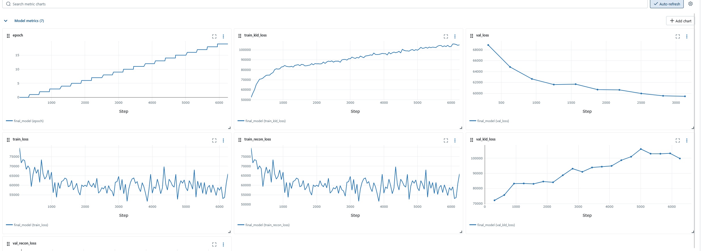
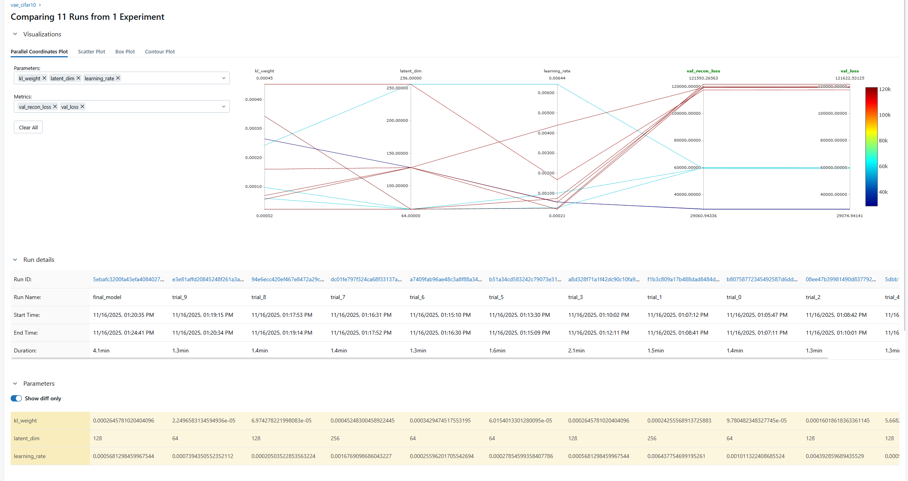
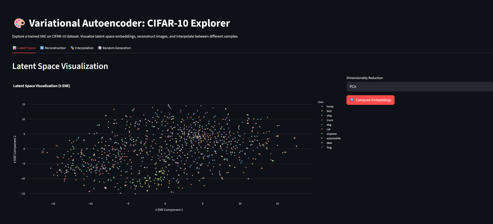

# Torch Lighning project

goal: use torch lightning, something for hyperparameters search and something for logging. 

Solution: Training a VAE model on CIFAR-10 dataset. 
```sh
python train.py --skip_optuna --final_epochs 30
```
Will train a model and later save it to a checkpoint that you can use in streamlit.

The model itself is okay-ish, the dashboard though I like very much (thank you claude).

| lib | why |
| --- | --- | 
| lightning | Forced... |
| MLFlow | Never used it before wanted to take a look |
| optuna | Simple (but i kinda dislike it) |

---
MLFlow

Overall works nicely and syntax is easy enough.

```sh
mlflow ui --backend-store-uri ./mlruns
```
Will start a UI based on local scores. Seems cool for self-hosting. I saw that they allow easy connection with databricks. 

NOTE: Apparently the way I have it implemented is deprecated and I should've used a database backend but it works on my end so I'm keeping it.

The UI is incredibly similar to wandb and you can click through everything and it looks decent.


You can compare multiple runs, e.g. here's one comparing multiple trials from optuna


Looking at the metrics I see that there might be something wrong with the model/training/loss. And it would normally prompt me to check under the hood so I would say that the goal of this project was reached. 


___
Lightning

Less boilerplate compared to raw torch. Great for when you don't need to control everything (which would be most of the times). 

There's still a little learning curve to the API, I don't see it replacing torch in older projects but it's nice not having to define everything.

___
Optuna

I've used it heavily in some other project and didn't really enjoy it. The dashboard is a little buggy. 


### Streamlit

I've also added streamlit because what is VAE without nice images. We have LLMs to thank for the excessive amount of emojis but overall I've clicked through it and it works as intended.


Here's the reconstucrion of images from VAE.


